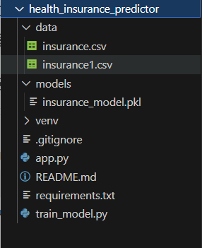

# 🛡️ Health Insurance Predictor

## Predictive Health Insurance Model for Shield Insurance

### 📖 Overview  
This project builds a machine learning-powered web application to predict individual health insurance premiums based on personal attributes such as:

- Age  
- BMI  
- Smoking status  
- Number of children  
- Region  
- Sex  

The goal is to assist insurance underwriters in generating accurate premium quotes quickly and interactively via a simple Streamlit interface.

---

## 📁 Project Structure


---

## 💾 Installation

Follow these steps to set up and run the project locally:

### 1. Clone the repository

```bash
git clone <https://github.com/RoBiul-Hasan-Jisan/health_insurance_predictor>
cd health_insurance_predictor
pip install -r requirements.txt
pip install pandas numpy scikit-learn xgboost lightgbm streamlit
```
## Model Details

### Model Type
A stacking ensemble model combining the following regressors:

Random Forest Regressor

XGBoost Regressor

LightGBM Regressor

### Features Used
age

bmi

smoker

children

region

sex

Also includes polynomial interaction features (degree = 2).

### Data Processing
Categorical encoding (One-Hot or Label Encoding)

Polynomial feature expansion

Feature scaling with StandardScaler

### Performance
R² Score: Approximately 0.87–0.88 on test data

Demonstrates strong predictive performance with the current dataset and features

### Limitations
Achieving R² > 0.97 is currently unrealistic due to:

Limited feature richness

Inherent noise and variability in the dataset

### Suggestions for Improvement
Include richer medical and personal history features

Apply advanced feature engineering

Experiment with neural networks or hybrid models

# 🛡️ Health Insurance Predictor

## Predictive Health Insurance Model for Shield Insurance

### 📖 Overview  
This project builds a machine learning-powered web application to predict individual health insurance premiums based on personal attributes such as:

- Age  
- BMI  
- Smoking status  
- Number of children  
- Region  
- Sex  

The goal is to assist insurance underwriters in generating accurate premium quotes quickly and interactively via a simple Streamlit interface.

---

## 📁 Project Structure


---

## 💾 Installation

Follow these steps to set up and run the project locally:

### 1. Clone the repository

```bash
git clone <your_repo_url>
cd health_insurance_predictor
pip install -r requirements.txt
pip install pandas numpy scikit-learn xgboost lightgbm streamlit
```
## Model Details

### Model Type
A stacking ensemble model combining the following regressors:

Random Forest Regressor

XGBoost Regressor

LightGBM Regressor

### Features Used
age

bmi

smoker

children

region

sex

Also includes polynomial interaction features (degree = 2).

### Data Processing
Categorical encoding (One-Hot or Label Encoding)

Polynomial feature expansion

Feature scaling with StandardScaler

### Performance
R² Score: Approximately 0.87–0.88 on test data

Demonstrates strong predictive performance with the current dataset and features

### Limitations
Achieving R² > 0.97 is currently unrealistic due to:

Limited feature richness

Inherent noise and variability in the dataset

### Suggestions for Improvement
Include richer medical and personal history features

Apply advanced feature engineering

Experiment with neural networks or hybrid models


##  How to Run the App
Run the Streamlit app using:

```bash
streamlit run app.py
```
## Output 


